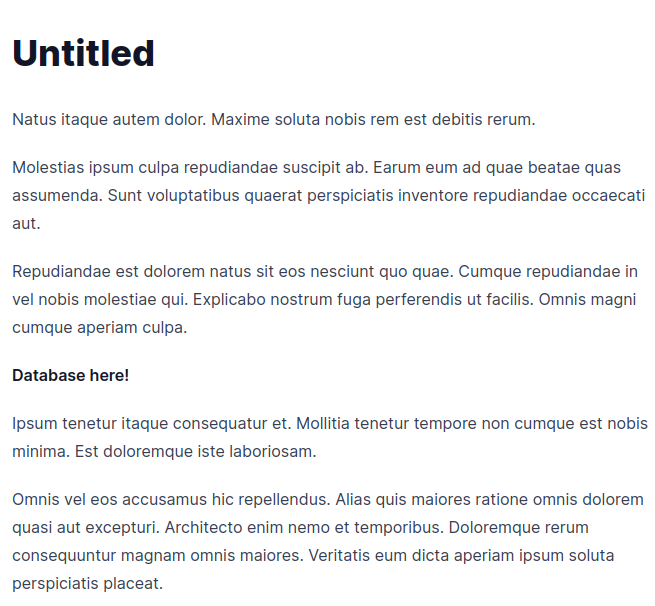
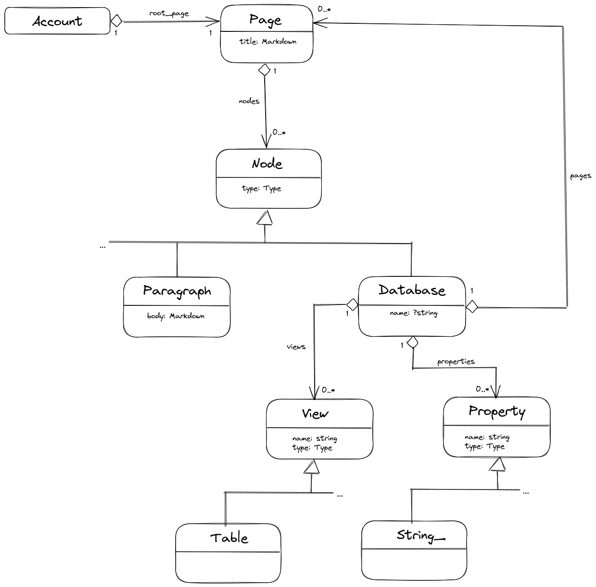

# blue-puffin

This is a throw-away project about custom properties in models.

## Overview

I'm trying to do here a simplified version of [Notion](https://www.notion.so/). Here is how it will work for a user.

During sign up, you specify a slug for your account, let's say `osmianski`, and after signing up you are redirected to the home page of your account, `/osmianski`: 

The page consists of nodes. Most nodes are paragraphs, some are "databases" - lists of child pages.

A database has at least one "view" - a way of presenting a list of child pages. The simplest view id an unordered HTML list of links to child pages. More sophisticated views are data tables, Kanban boards, and more.

A database may define additional properties for the child pages. 

Every child page has a slug under th parent page URL path, for example `/osmianski/page1`. If there is more than one database on a page, additional databases should have page-wide unique slugs, too: `/osmianski/database1/page1`.    

Every child page, may have databases with child pages, recursively.

Conceptually, it looks like follows:

As a page owner you can edit it in-place. Other users can see your public pages (currently, all pages are public).  
